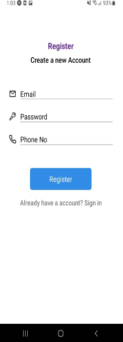
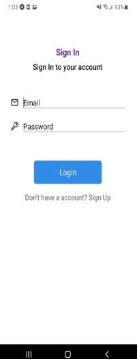
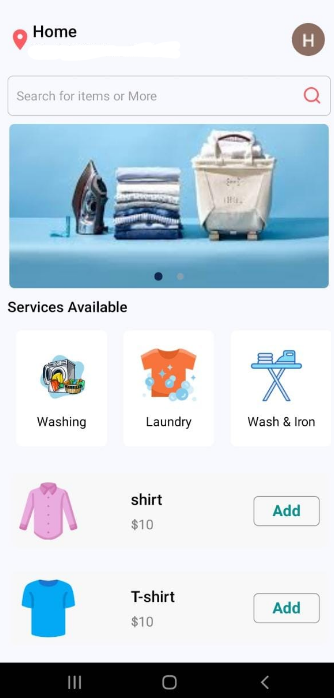
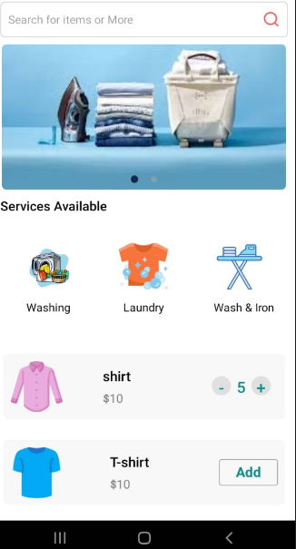
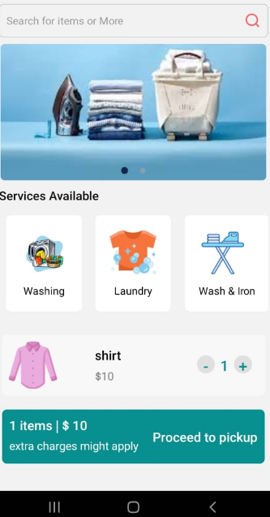
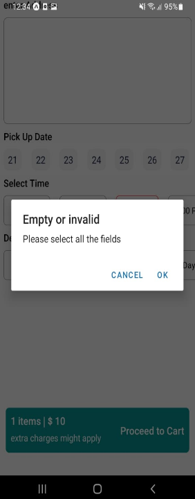
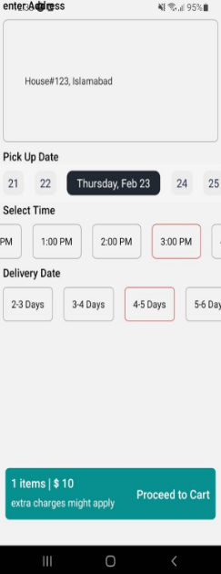
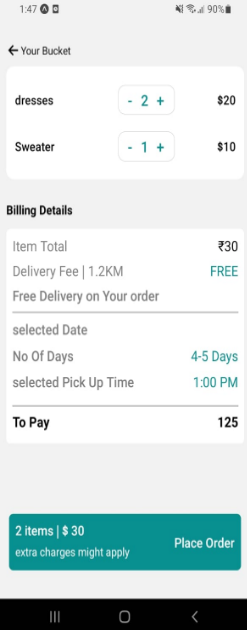
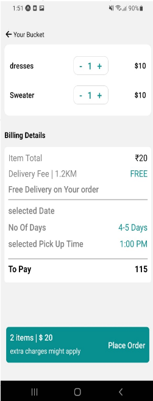
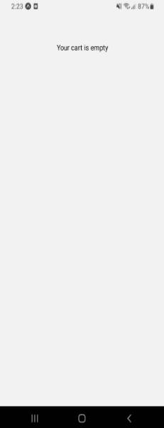

# 🧺 Laundry App Screens Description

## 📝 Register Screen
The Register Screen allows new users to create an account. It collects necessary information such as name, email, password, and contact details, ensuring a seamless registration process with Firebase.

- **New Account Setup**: User-friendly registration form.
- **Required Information**: Fields for name, email, password, and contact details.

---

## 🔐 LogIn Screen
The LogIn Screen is where users enter their credentials to access their accounts. It includes fields for the username and password, with options for password recovery or account creation using Firebase Authentication.

- **User Authentication**: Secure login with Firebase Authentication.
- **Password Recovery**: Options for recovering forgotten passwords.
- **Account Creation**: Link to register a new account.

---

## 👤 Profile Screen
The Profile Screen displays user-specific information and account settings. Users can view and edit their personal details, address, and payment methods, and manage their order history from this screen.

- **Personal Details**: View and edit user information.
- **Address Management**: Add or update address information.
- **Order History**: Track past laundry orders.

---

## 🏠 Home Screen
The Home Screen serves as the landing page for users, showcasing available laundry services and promotional offers. Users can browse through various services and select items to view in detail.

- **Available Services**: Highlighted laundry services and special offers.
- **Categories**: Easy navigation through different types of laundry services (e.g., dry cleaning, wash & fold).
- **Search Functionality**: Users can search for specific services or items.

---

## 🏬 Pickup Screen
The Pickup Screen allows users to schedule a pickup for their laundry. It displays available time slots and allows users to select the most convenient option. Integration with the Google Navigation API helps in finding the nearest service locations.

- **Schedule Pickup**: Choose a convenient time slot for laundry pickup.
- **Location Selection**: Integration with Google Navigation API to find the nearest service location.

---

## 🛒 Cart Screen
The Cart Screen provides an overview of the laundry items and services that the user has selected. It includes item details, quantities, prices, and the total cost. Users can modify the cart contents or proceed to checkout from this screen.

- **Order Summary**: Detailed view of selected laundry services.
- **Modify Order**: Option to change quantities or remove items.
- **Total Cost**: Display of the total price for the selected services.

---

## ✅ Order Confirmation Screen
The Order Confirmation Screen provides a summary of the user's order after it has been placed. It includes details such as order number, items and services selected, total amount, and the estimated pickup or delivery time.

- **Order Summary**: Detailed confirmation of the placed order.
- **Order Number**: Unique identifier for tracking the order.
- **Estimated Time**: Information on pickup or delivery timing.

